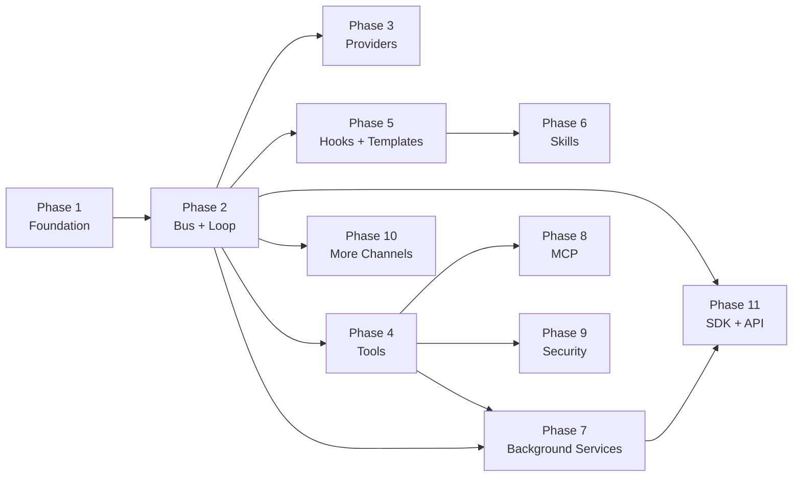

# Plan 2: NanoBotTS Evolution Roadmap

## Current State vs Goal — Gap Analysis

| Area | Current (flow.md) | Goal (flowGoal.md) | Gap |
|------|-------------------|---------------------|-----|
| **Channels** | CLI + Telegram (direct coupling) | 13+ channels via MessageBus | Missing bus, 11+ channels |
| **Message routing** | Channels call agent directly | MessageBus with async inbound/outbound queues | No bus layer |
| **Orchestrator** | None — channels own the loop | AgentLoop with per-session locks, semaphore | Missing entirely |
| **Agent iterations** | Max 10 | Max 200 | Config change + context mgmt |
| **Provider** | AzureOpenAI only | ProviderRegistry with 20+ (OpenAI-compat, Anthropic, Azure) | Single provider, no registry |
| **Tools** | 2 (time, web_search) | 10+ (filesystem, shell, web, message, cron, spawn, MCP) | Missing 8+ tools |
| **Tool Registry** | Basic registry | Formal ToolRegistry with validation, casting, concurrent exec | Needs hardening |
| **MCP** | None | MCPToolWrapper dynamically wrapping external MCP servers | Missing entirely |
| **Memory** | memory.md + session JSONL | MEMORY.md + HISTORY.md + token-aware consolidation | Missing HISTORY.md, token mgmt |
| **Session** | In-memory Session class | SessionManager with JSONL, consolidated offset tracking | Needs upgrade |
| **Context** | persona + memory + time + tools | identity + templates (SOUL/AGENTS/TOOLS/USER.md) + memory + skills | Missing templates, skills |
| **Skills** | None | SkillsLoader with progressive loading, SKILL.md files | Missing entirely |
| **Hooks** | None | AgentHook + CompositeHook lifecycle callbacks | Missing entirely |
| **Background** | None | SubagentManager, CronService, HeartbeatService | Missing entirely |
| **Security** | None | SSRF protection, URL validation, workspace restriction | Missing entirely |
| **SDK/API** | None | Nanobot SDK class + OpenAI-compatible HTTP server | Missing entirely |
| **Streaming** | Basic per-channel | Through bus with delta coalescing | Needs bus integration |

---

## Phased Implementation Plan

### Phase 1: Foundation Hardening

**Goal:** Strengthen existing core to support future layers.

- [ ] **1.1 Formal ToolRegistry** — Add `validate()`, `castParams()`, `prepareCall()` to `tools/base.ts`. Support `readOnly`, `concurrencySafe` flags per tool.
- [ ] **1.2 Increase max iterations** — Change AgentRunner from 10 to 200. Add configurable `maxIterations` to config.
- [ ] **1.3 Context window management** — Add `snipHistory()` to trim old messages when approaching token limit. Add `applyToolResultBudget()` to truncate large tool outputs. Add token estimation utility.
- [ ] **1.4 SessionManager upgrade** — Extract session persistence logic from channels into a dedicated `SessionManager` class. Track `lastConsolidated` offset for memory archival.
- [ ] **1.5 HISTORY.md** — Add searchable chronological log alongside MEMORY.md. Append raw message summaries on each consolidation.

### Phase 2: MessageBus + AgentLoop

**Goal:** Decouple channels from agent via async message routing.

- [ ] **2.1 MessageBus** — Create `bus/queue.ts` with `InboundMessage` and `OutboundMessage` types. Two async queues (inbound, outbound).
- [ ] **2.2 AgentLoop** — Create `core/loop.ts` as central orchestrator. Consumes from inbound queue, dispatches per-session with concurrency control (per-session lock + global semaphore). Publishes results to outbound queue.
- [ ] **2.3 Refactor channels** — Channels no longer call AgentRunner directly. Instead: receive message -> publish to bus inbound. Subscribe to bus outbound -> send to user.
- [ ] **2.4 ChannelManager** — Create `channels/manager.ts` for channel discovery, starting/stopping, and outbound dispatch with delta coalescing for streaming.
- [ ] **2.5 Update index.ts** — Wire MessageBus, AgentLoop, ChannelManager together. Channels become thin I/O adapters.

### Phase 3: Provider Registry + Multi-Provider

**Goal:** Support multiple LLM backends.

- [ ] **3.1 LLMProvider interface** — Create `providers/base.ts` with abstract `chat()`, `chatWithTools()`, `chatStream()`. Add `LLMResponse` type with `content`, `toolCalls`, `finishReason`, `usage`.
- [ ] **3.2 ProviderRegistry** — Create `providers/registry.ts` with keyword-based auto-matching. Register providers by name.
- [ ] **3.3 Refactor AzureOpenAIProvider** — Implement the new LLMProvider interface. Add retry with exponential backoff.
- [ ] **3.4 OpenAICompatProvider** — Generic provider supporting any OpenAI-compatible API (OpenAI, Groq, Together, local LLMs, etc.).
- [ ] **3.5 AnthropicProvider** — Native Claude API support with prompt caching.
- [ ] **3.6 Config-driven provider selection** — Update config.json schema to support multiple providers. Select provider by name at startup or per-request.

### Phase 4: Expanded Tool Suite

**Goal:** Add the tools that make the agent actually useful.

- [ ] **4.1 Filesystem tools** — `read_file` (with pagination, line numbers), `write_file` (auto-create dirs), `edit_file` (find-and-replace), `list_dir` (recursive).
- [ ] **4.2 Shell tool** — `exec` for running shell commands. Add deny-list for dangerous commands. Timeout support.
- [ ] **4.3 Web fetch tool** — `web_fetch` to download URL content and convert to markdown. Complement existing `web_search`.
- [ ] **4.4 Message tool** — `message` to send text/media back to a chat channel via the MessageBus outbound queue.
- [ ] **4.5 Concurrent tool execution** — When multiple tool calls arrive in one response, execute concurrency-safe tools in parallel.

### Phase 5: Hook System + Templates

**Goal:** Enable lifecycle callbacks and template-driven system prompts.

- [ ] **5.1 AgentHook interface** — Create `core/hook.ts` with lifecycle methods: `beforeIteration`, `onStream`, `onStreamEnd`, `beforeExecuteTools`, `afterIteration`, `finalizeContent`.
- [ ] **5.2 CompositeHook** — Fan-out to multiple hooks with error isolation per hook.
- [ ] **5.3 Template system** — Create `templates/` directory with SOUL.md (persona/identity), AGENTS.md (agent behavior), TOOLS.md (tool usage guidance), USER.md (user-specific context).
- [ ] **5.4 Refactor ContextBuilder** — Assemble system prompt from templates + memory + skills instead of a single persona string.

### Phase 6: Skills System

**Goal:** Progressive skill loading so the agent can learn new capabilities on demand.

- [ ] **6.1 SkillsLoader** — Create `core/skills.ts`. Scan `skills/` directory for SKILL.md files. Parse frontmatter (name, description, alwaysOn, dependencies).
- [ ] **6.2 Built-in skills** — Create SKILL.md files for: memory management, cron scheduling, github integration, weather, summarization.
- [ ] **6.3 Progressive loading** — Always-on skills injected into every prompt. Other skills listed in summary; agent reads full content on demand via `read_file`.
- [ ] **6.4 Workspace skills** — Support user-defined SKILL.md files in the working directory that override built-in skills.

### Phase 7: Background Services

**Goal:** Enable scheduled tasks, autonomous operation, and background work.

- [ ] **7.1 CronService** — Create `cron/service.ts`. Support interval-based, cron-expression, and one-time scheduling. Persist jobs to JSON file. Timezone-aware.
- [ ] **7.2 Cron tool** — `cron` tool for the agent to add/list/remove scheduled jobs.
- [ ] **7.3 SubagentManager** — Create `core/subagent.ts`. Spawn background AgentRunner instances with limited tool access (no message, no spawn to prevent recursion).
- [ ] **7.4 Spawn tool** — `spawn` tool for the agent to launch background tasks. Results announced via MessageBus.
- [ ] **7.5 HeartbeatService** — Create `heartbeat/service.ts`. Periodically read HEARTBEAT.md, ask LLM if there are tasks to execute, optionally notify user.

### Phase 8: MCP Integration

**Goal:** Connect to external MCP servers and dynamically wrap their tools.

- [ ] **8.1 MCP client** — Create `tools/mcp.ts`. Support stdio, SSE, and streamable HTTP transports.
- [ ] **8.2 MCPToolWrapper** — Dynamically convert each MCP server tool into a nanobot Tool (name, description, parameters, execute).
- [ ] **8.3 Config-driven MCP** — Add `mcp` section to config.json for defining MCP server connections. Lazy-load on first use.
- [ ] **8.4 MCP tool namespacing** — Prefix tool names with server name to avoid collisions.

### Phase 9: Security Layer

**Goal:** Protect against misuse and dangerous operations.

- [ ] **9.1 SSRF protection** — Validate URLs in web tools against private IP ranges and internal hostnames.
- [ ] **9.2 Workspace restriction** — Filesystem tools restricted to configured workspace directory.
- [ ] **9.3 Shell deny-list** — Block dangerous shell commands (rm -rf /, format, etc.).
- [ ] **9.4 Channel permissions** — Per-channel allowlists for users/groups. Permission check before processing.

### Phase 10: More Channels

**Goal:** Expand beyond CLI + Telegram.

- [ ] **10.1 Channel plugin interface** — Standardize BaseChannel with `start()`, `stop()`, `send()`, `sendDelta()`, `isAllowed()`.
- [ ] **10.2 Discord channel** — Using discord.js.
- [ ] **10.3 Slack channel** — Using Slack Bolt SDK.
- [ ] **10.4 WhatsApp channel** — Via WhatsApp Business API or bridge.
- [ ] **10.5 Email channel** — IMAP/SMTP-based.
- [ ] **10.6 Channel discovery** — Auto-discover and register channels from a channels directory or plugin entry points.

### Phase 11: SDK + API Layer

**Goal:** Expose NanoBotTS for programmatic use and as an API server.

- [ ] **11.1 Nanobot SDK class** — Public facade: `Nanobot.fromConfig()`, `nanobot.run(message)`. Wraps AgentLoop for simple programmatic use.
- [ ] **11.2 OpenAI-compatible API server** — HTTP server (`nanobot serve`) that exposes `/v1/chat/completions` compatible endpoint. Enables use as a drop-in replacement.
- [ ] **11.3 CLI improvements** — Add commands: `nanobot onboard` (setup wizard), `nanobot agent` (interactive), `nanobot serve` (API server), `nanobot status`.

---

## Priority Order

```
Phase 1 (Foundation)  ━━━ must do first, everything depends on it
Phase 2 (Bus + Loop)  ━━━ architectural unlock for everything else
Phase 3 (Providers)   ━━━ high value, moderate effort
Phase 4 (Tools)       ━━━ high value, makes agent useful
Phase 5 (Hooks)       ━━━ enables extensibility
Phase 6 (Skills)      ━━━ nice to have, builds on templates
Phase 7 (Background)  ━━━ advanced, builds on bus + tools
Phase 8 (MCP)         ━━━ advanced, builds on tool registry
Phase 9 (Security)    ━━━ important before production use
Phase 10 (Channels)   ━━━ scale, builds on bus
Phase 11 (SDK/API)    ━━━ final polish, builds on everything
```

## Dependency Graph


