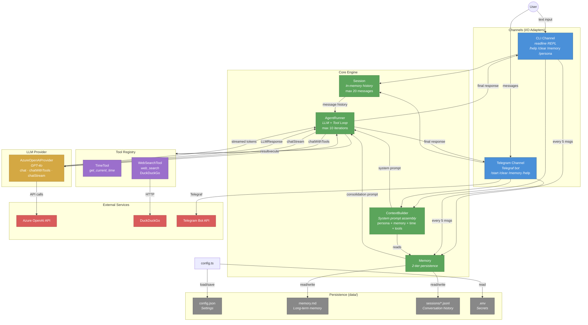

# NanoBotTS System Architecture

## Key Data Flow

1. **User input** → Channel (CLI/Telegram) → Session + ContextBuilder → **AgentRunner**
2. **Agent loop**: LLM call → if tool_calls → execute tool → feed result back → repeat
3. **Final response** streamed back to the channel → displayed to user
4. **Memory consolidation**: every 5 user messages, the LLM extracts key facts → saved to `memory.md`
5. **Session persistence**: full conversation saved as JSONL in `data/sessions/`
