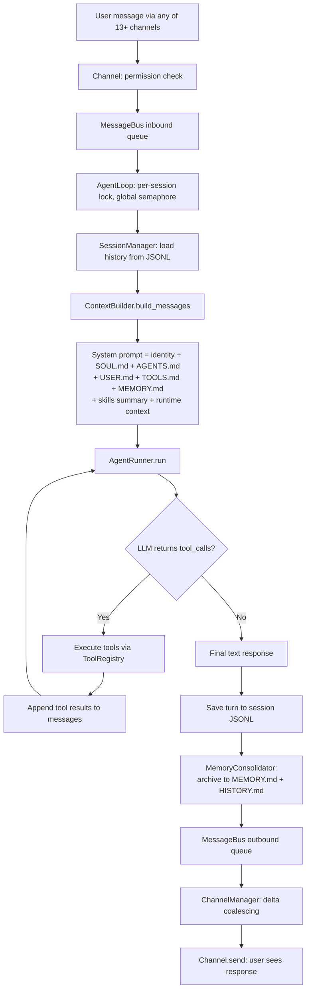

# HKUDS/nanobot — System Architecture (Goal Reference)

```mermaid
graph TB
    User((User))

    TG["Telegram"]
    DC["Discord"]
    SL["Slack"]
    WA["WhatsApp"]
    More["WeChat / Feishu / DingTalk<br/>Matrix / Email / QQ / etc."]

    InQ["MessageBus<br/>Inbound Queue"]
    OutQ["MessageBus<br/>Outbound Queue"]

    AgentLoop["AgentLoop<br/>Central Orchestrator<br/>per-session locks"]
    AgentRunner["AgentRunner<br/>LLM + Tool-use Loop<br/>up to 200 iterations"]
    Context["ContextBuilder<br/>System Prompt Assembly"]
    Hook["AgentHook<br/>Lifecycle Callbacks"]

    SessMgr["SessionManager<br/>JSONL per chat_id"]

    MemConsol["MemoryConsolidator"]
    MemoryMD["MEMORY.md<br/>Long-term Facts"]
    HistoryMD["HISTORY.md<br/>Searchable Log"]

    ToolReg["ToolRegistry"]
    FS["read_file / write_file<br/>edit_file / list_dir"]
    Shell["exec - Shell Commands"]
    Web["web_search / web_fetch"]
    MsgTool["message - Send to Channel"]
    CronTool["cron - Schedule Tasks"]
    SpawnTool["spawn - Background Subagent"]
    MCPWrap["MCPToolWrapper<br/>Dynamic MCP Tools"]

    Skills["SkillsLoader<br/>Progressive Loading<br/>SKILL.md files"]
    Templates["Templates<br/>SOUL.md / AGENTS.md<br/>TOOLS.md / USER.md"]

    ProvReg["ProviderRegistry"]
    OpenAI["OpenAICompatProvider<br/>20+ services via LiteLLM"]
    Claude["AnthropicProvider<br/>Native Claude API"]
    AzureOAI["AzureOpenAIProvider"]

    CronSvc["CronService<br/>Interval / Cron / One-time"]
    Heartbeat["HeartbeatService<br/>Periodic Autonomous Tasks"]
    SubAgent["SubagentManager<br/>Background AgentRunner"]

    ExtMCP["External MCP Servers"]
    ExtWeb["Search APIs<br/>Brave / Tavily / DDG"]
    OS["OS / Filesystem"]

    SDK["Nanobot SDK"]
    Serve["nanobot serve<br/>OpenAI-compatible API"]
    CLI["CLI - Typer<br/>onboard / agent / gateway"]

    NetSec["Security<br/>SSRF / URL / Workspace"]

    User -->|message| TG
    User -->|message| DC
    User -->|message| SL
    User -->|message| WA
    User -->|message| More

    TG --> InQ
    DC --> InQ
    SL --> InQ
    WA --> InQ
    More --> InQ

    OutQ --> TG
    OutQ --> DC
    OutQ --> SL
    OutQ --> WA
    OutQ --> More

    InQ --> AgentLoop
    AgentLoop --> OutQ

    AgentLoop --> SessMgr
    AgentLoop --> Context
    Context --> MemoryMD
    Context --> Skills
    Skills --> Templates
    Context --> Templates

    AgentLoop --> AgentRunner
    AgentRunner --> Hook

    AgentRunner --> ProvReg
    ProvReg --> OpenAI
    ProvReg --> Claude
    ProvReg --> AzureOAI

    AgentRunner --> ToolReg
    ToolReg --> FS
    ToolReg --> Shell
    ToolReg --> Web
    ToolReg --> MsgTool
    ToolReg --> CronTool
    ToolReg --> SpawnTool
    ToolReg --> MCPWrap

    AgentLoop --> MemConsol
    MemConsol --> MemoryMD
    MemConsol --> HistoryMD

    AgentLoop --> CronSvc
    AgentLoop --> Heartbeat
    AgentLoop --> SubAgent
    SpawnTool --> SubAgent
    SubAgent --> AgentRunner
    CronSvc --> AgentLoop
    Heartbeat --> AgentLoop

    MCPWrap --> ExtMCP
    Web --> ExtWeb
    Shell --> OS
    FS --> OS

    NetSec -.-> Web
    NetSec -.-> Shell

    SDK --> AgentLoop
    Serve --> AgentLoop
    CLI --> AgentLoop

    classDef channel fill:#4A90D9,stroke:#2C5F8A,color:#fff
    classDef bus fill:#E8913A,stroke:#B06E2A,color:#fff
    classDef core fill:#5BA55B,stroke:#3D7A3D,color:#fff
    classDef memory fill:#D95B5B,stroke:#A03D3D,color:#fff
    classDef tool fill:#9B6FCC,stroke:#6F4D99,color:#fff
    classDef provider fill:#D4A843,stroke:#A07E2E,color:#fff
    classDef bg fill:#5BBBB5,stroke:#3D8A85,color:#fff
    classDef config fill:#888,stroke:#555,color:#fff
    classDef api fill:#CC6FA0,stroke:#994D78,color:#fff
    classDef external fill:#666,stroke:#444,color:#fff
    classDef security fill:#AA4444,stroke:#883333,color:#fff

    class TG,DC,SL,WA,More channel
    class InQ,OutQ bus
    class AgentLoop,AgentRunner,Context,Hook core
    class MemConsol,MemoryMD,HistoryMD memory
    class ToolReg,FS,Shell,Web,MsgTool,CronTool,SpawnTool,MCPWrap tool
    class ProvReg,OpenAI,Claude,AzureOAI provider
    class CronSvc,Heartbeat,SubAgent bg
    class Skills,Templates config
    class SDK,Serve,CLI api
    class ExtMCP,ExtWeb,OS external
    class NetSec security
```

## Key Data Flow

## Architecture Highlights

| Feature | Detail |
|---------|--------|
| **Tool-use loop** | Up to 200 iterations with concurrent tool execution |
| **13+ channels** | Telegram, Discord, Slack, WhatsApp, WeChat, Feishu, DingTalk, Matrix, Email, QQ, etc. |
| **MessageBus** | Decoupled async inbound/outbound queues between channels and agent |
| **Two-layer memory** | MEMORY.md (LLM-consolidated facts) + HISTORY.md (searchable log) |
| **MCP integration** | Dynamically wraps external MCP server tools (stdio/SSE/HTTP) |
| **Background subagents** | spawn tool launches independent AgentRunner instances |
| **Scheduled tasks** | CronService with interval, cron-expr, and one-time scheduling |
| **Heartbeat** | Periodic autonomous task checking via HeartbeatService |
| **Skills system** | Progressive loading — summary in prompt, full content on demand |
| **20+ LLM providers** | OpenAI-compat (LiteLLM), native Anthropic, Azure, GitHub Copilot, Codex |
| **Streaming** | Token-by-token through bus with delta coalescing per channel |
| **Security** | SSRF protection, URL validation, workspace restriction, shell deny-lists |
| **SDK + API** | Nanobot class for programmatic use + OpenAI-compatible HTTP server |
