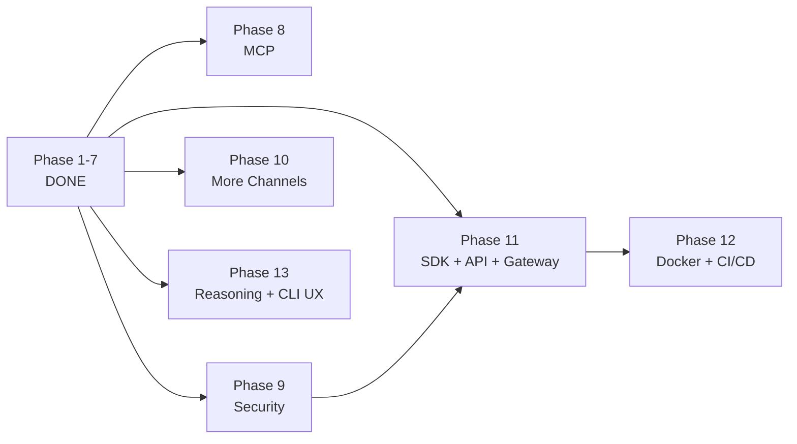

# Plan 2: NanoBotTS Evolution Roadmap

## Current State vs Goal — Gap Analysis

| Area | Current (flow.md) | Goal (flowGoal.md) | Status |
|------|-------------------|---------------------|--------|
| **Channels** | CLI + Telegram via MessageBus | 13+ channels via MessageBus | Phase 2 done, Phase 10 pending |
| **Message routing** | MessageBus with async queues | MessageBus with async inbound/outbound queues | Done |
| **Orchestrator** | AgentLoop with per-session locks | AgentLoop with per-session locks, semaphore | Done |
| **Agent iterations** | Max 200, configurable | Max 200 | Done |
| **Provider** | ProviderRegistry (Azure, OpenAI-compat) | ProviderRegistry with 20+ | Phase 3 done, more providers later |
| **Tools** | 13 tools | 10+ (filesystem, shell, web, message, cron, spawn, MCP) | Phase 4 done, MCP pending |
| **Tool Registry** | Formal with validation, casting, concurrent exec | Formal ToolRegistry | Done |
| **MCP** | None | MCPToolWrapper dynamically wrapping external MCP servers | Phase 8 pending |
| **Memory** | MEMORY.md + HISTORY.md + token-aware consolidation | MEMORY.md + HISTORY.md + token-aware consolidation | Done |
| **Session** | SessionManager with JSONL, consolidated offset | SessionManager with JSONL, consolidated offset tracking | Done |
| **Context** | Templates (SOUL/AGENTS/TOOLS/USER.md) + memory + skills | identity + templates + memory + skills | Done |
| **Skills** | SkillsLoader with always/on-demand + load_skill tool | SkillsLoader with progressive loading | Done |
| **Hooks** | AgentHook + CompositeHook | AgentHook + CompositeHook lifecycle callbacks | Done |
| **Background** | CronService + SubagentManager + HeartbeatService (2-phase) | SubagentManager, CronService, HeartbeatService | Done |
| **Security** | Shell deny-list only | SSRF protection, URL validation, workspace restriction | Phase 9 pending |
| **SDK/API** | None | Nanobot SDK class + OpenAI-compatible HTTP server + gateway | Phase 11 pending |
| **Streaming** | Through bus with delta coalescing | Through bus with delta coalescing | Done |

---

## Phased Implementation Plan

### Phase 1: Foundation Hardening — DONE

- [x] **1.1 Formal ToolRegistry** — validate(), castParams(), prepareCall(), readOnly/concurrencySafe flags
- [x] **1.2 Increase max iterations** — 200, configurable
- [x] **1.3 Context window management** — snipHistory(), applyToolResultBudget(), token estimation
- [x] **1.4 SessionManager upgrade** — dedicated class, lastConsolidated offset
- [x] **1.5 HISTORY.md** — searchable chronological log

### Phase 2: MessageBus + AgentLoop — DONE

- [x] **2.1 MessageBus** — async inbound/outbound queues
- [x] **2.2 AgentLoop** — central orchestrator with per-session locks, semaphore
- [x] **2.3 Refactor channels** — thin I/O adapters publishing to bus
- [x] **2.4 ChannelManager** — channel discovery, outbound dispatch
- [x] **2.5 Update index.ts** — full wiring

### Phase 3: Provider Registry + Multi-Provider — DONE

- [x] **3.1 LLMProvider interface** — abstract base with retry
- [x] **3.2 ProviderRegistry** — keyword-based auto-matching
- [x] **3.3 Refactor AzureOpenAIProvider** — extends LLMProvider
- [x] **3.4 OpenAICompatProvider** — generic OpenAI-compatible
- [ ] **3.5 AnthropicProvider** — deferred (not needed until user wants Claude)
- [x] **3.6 Config-driven provider selection** — auto-detect from env vars

### Phase 4: Expanded Tool Suite — DONE

- [x] **4.1 Filesystem tools** — read_file, write_file, edit_file, list_dir
- [x] **4.2 Shell tool** — exec with deny-list and timeout
- [x] **4.3 Web fetch tool** — web_fetch with HTML-to-text
- [x] **4.4 Message tool** — sends to MessageBus outbound
- [x] **4.5 Concurrent tool execution** — concurrencySafe tools run in parallel

### Phase 5: Hook System + Templates — DONE

- [x] **5.1 AgentHook interface** — beforeIteration, onStream, onStreamEnd, beforeExecuteTools, afterIteration, finalizeContent
- [x] **5.2 CompositeHook** — fan-out with error isolation
- [x] **5.3 Template system** — SOUL.md, AGENTS.md, TOOLS.md, USER.md
- [x] **5.4 Refactor ContextBuilder** — assembles from templates + memory + skills

### Phase 6: Skills System — DONE

- [x] **6.1 SkillsLoader** — scans skills/ directories, parses frontmatter (name, description, always)
- [x] **6.2 Built-in skills** — memory (always-on), github (always-on), weather (always-on), summarize (on-demand)
- [x] **6.3 Progressive loading** — always-on injected, on-demand listed in summary + load_skill tool
- [x] **6.4 Workspace skills** — ./skills/ overrides src/skills/ by name

### Phase 7: Background Services — DONE

- [x] **7.1 CronService** — interval, cron-expression, one-time scheduling. Persists to JSON.
- [x] **7.2 Cron tool** — add/list/remove scheduled jobs
- [x] **7.3 SubagentManager** — background AgentRunner with limited tools (no message/spawn/cron)
- [x] **7.4 Spawn tool** — launch background tasks, results via MessageBus
- [x] **7.5 HeartbeatService** — 2-phase: LLM decides "run/skip" before executing

### Phase 8: MCP Integration — PENDING

**Goal:** Connect to external MCP servers and dynamically wrap their tools.

- [ ] **8.1 MCP client** — Create `tools/mcp.ts`. Support stdio, SSE, and streamable HTTP transports.
- [ ] **8.2 MCPToolWrapper** — Dynamically convert each MCP server tool into a nanobot Tool (name, description, parameters, execute). Include JSON Schema normalization for OpenAI compatibility (handle oneOf, anyOf, nullable types).
- [ ] **8.3 Config-driven MCP** — Add `tools.mcpServers` section to config.json. Per-server config: command/args (stdio), url/headers (HTTP), `enabledTools` filter (whitelist or `"*"`), `toolTimeout` (default 30s).
- [ ] **8.4 MCP tool namespacing** — Prefix tool names with server name (e.g., `filesystem_read_file`) to avoid collisions across servers.

*Gaps found vs original nanobot:*
- *Added: `enabledTools` per-server whitelist filter*
- *Added: `toolTimeout` per-server timeout config*
- *Added: JSON Schema normalization (oneOf/anyOf → OpenAI-compat)*

### Phase 9: Security Layer — PENDING (partially done)

**Goal:** Protect against misuse and dangerous operations.

- [x] **9.1 SSRF protection** — Validate URLs in web tools against private IP ranges (RFC1918, loopback, link-local, cloud metadata 169.254.x.x). DNS resolution before IP check. Post-redirect validation. Configurable whitelist for trusted CIDRs.
- [x] **9.2 Shell deny-list** — Already implemented in `tools/shell.ts`. Block dangerous commands.
- [x] **9.3 Workspace restriction** — Filesystem tools restricted to configured workspace directory. Validate resolved paths stay within boundary.
- [x] **9.4 Channel permissions** — Per-channel allowlists for users/groups. Permission check in channel `_handle_message()` before publishing to bus.
- [x] **9.5 URL extraction scanning** — Scan shell commands for embedded URLs and validate them against SSRF rules before execution.

*Note: Original nanobot only implements SSRF (9.1). Items 9.2-9.5 are our additions — broader than original.*

### Phase 10: Channel Plugin Interface — PENDING

**Goal:** Standardize the channel interface so new channels can be added easily later.

- [ ] **10.1 Channel plugin interface** — Standardize BaseChannel with `start()`, `stop()`, `send()`, `sendDelta()`, `isAllowed()`. New channels (Discord, Slack, etc.) can be added anytime by implementing this interface — no dedicated phase needed.

### Phase 11: SDK + API Layer — PENDING

**Goal:** Expose NanoBotTS for programmatic use and as an API server.

- [ ] **11.1 Nanobot SDK class** — Public facade: `Nanobot.fromConfig()`, `nanobot.run(message, sessionKey, hooks)`. Returns `RunResult` with content, toolsUsed, messages. Wraps AgentLoop for simple programmatic use.
- [ ] **11.2 OpenAI-compatible API server** — `nanobot serve --port 18790` exposes `/v1/chat/completions` endpoint. Enables use as a drop-in replacement for OpenAI API.
- [ ] **11.3 Gateway command** — `nanobot gateway` runs the full orchestrator: MessageBus + all channels + CronService + HeartbeatService + API server. This is what docker-compose runs in production.
- [ ] **11.4 CLI improvements** — Add commands: `nanobot onboard` (setup wizard), `nanobot agent` (interactive REPL), `nanobot serve` (API only), `nanobot gateway` (full server), `nanobot status` (health check).

*Gaps found vs original nanobot:*
- *Added: `gateway` command separate from `serve` (serve = HTTP API only, gateway = full orchestrator)*
- *Added: `RunResult` return type for SDK with content, toolsUsed, messages*
- *Added: hooks parameter on SDK `run()` for per-request lifecycle callbacks*

### Phase 12: Docker + CI/CD — NEW

**Goal:** Package for deployment and automate testing.

- [ ] **12.1 Dockerfile** — Single-stage Node.js 22 build. Compile TypeScript, run with production deps.
- [ ] **12.2 docker-compose.yml** — Two services: `nanobotts-gateway` (production, resource limits, restart: always) and `nanobotts-cli` (interactive dev).
- [ ] **12.3 .dockerignore** — Exclude node_modules, dist, .env, data, .git, tests.
- [ ] **12.4 GitHub Actions CI** — `.github/workflows/ci.yml`: run `tsc --noEmit` + `npm test` on push/PR to main.

*See plan3.md for full details.*

### Phase 13: Reasoning Display + CLI UX — PENDING

**Goal:** Surface LLM reasoning tokens and improve the CLI experience from dev prototype to usable tool.

#### 13A: Reasoning Token Passthrough

Capture and display the model's chain-of-thought (e.g., OpenAI o1/o3/o4-mini `reasoning_content`).

- [ ] **13A.1 Extend LLMResponse type** — Add optional `reasoning: string` field to `LLMResponse` in `types.ts`.
- [ ] **13A.2 Provider extraction** — Update `AzureOpenAIProvider` and `OpenAICompatProvider` to extract `reasoning_content` from API responses (both streaming and non-streaming).
- [ ] **13A.3 Streaming reasoning chunks** — Reasoning tokens arrive before content tokens. Propagate them through MessageBus as a distinct delta type (e.g., `isDelta: true, isReasoning: true`).
- [ ] **13A.4 AgentRunner passthrough** — Ensure reasoning is preserved through the agent loop and available to hooks and channels.
- [ ] **13A.5 Channel display** — CLI renders reasoning in dimmed/grey text. Telegram could use a collapsible `<blockquote>` or spoiler tag. Add `/reasoning on|off` toggle to CLI (default: on).

#### 13B: CLI UX Polish

Improve terminal experience with minimal dependencies (`chalk`, `ora`, `marked-terminal`).

- [ ] **13B.1 Thinking spinner** — Show a spinner (e.g., `ora`) between user input and first streaming token. Stop spinner when first delta arrives.
- [ ] **13B.2 Terminal colors** — Use `chalk` to distinguish user input, bot output, system messages, errors, and tool activity.
- [ ] **13B.3 Markdown rendering** — Render LLM markdown output (headers, lists, bold, code blocks) using `marked` + `marked-terminal` for readable terminal output.
- [ ] **13B.4 Syntax-highlighted code blocks** — Highlight code blocks in LLM responses with language-aware coloring.
- [ ] **13B.5 Tool execution feedback** — Show which tools are being called during agent runs (e.g., `[calling web_fetch...]`). Implement as an `AgentHook` that emits status lines via the bus.
- [ ] **13B.6 Input history** — Enable arrow-up recall of previous messages using `readline` history support.

*Dependencies: `chalk`, `ora`, `marked`, `marked-terminal`, `cli-highlight` (~440KB total). No architecture changes — drop-in additions to existing CLIChannel and providers.*

---

## Priority Order

```
Phase 1-7    ━━━ DONE
Phase 8      ━━━ MCP integration (advanced, builds on tool registry)
Phase 9      ━━━ Security (important before production use, partially done)
Phase 10     ━━━ More channels (scale, builds on bus)
Phase 11     ━━━ SDK/API + gateway (final architecture, builds on everything)
Phase 12     ━━━ Docker + CI/CD (deployment, builds on Phase 11 gateway)
Phase 13     ━━━ Reasoning display + CLI UX (independent, can start anytime)
```

## Dependency Graph


